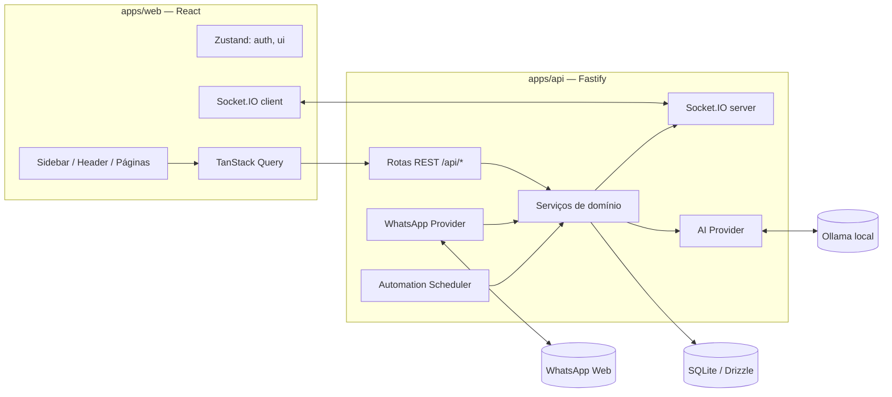
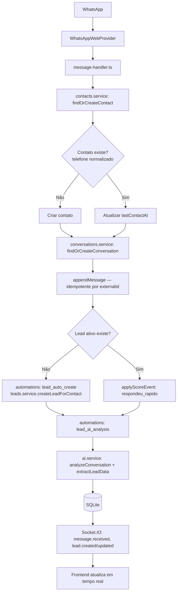
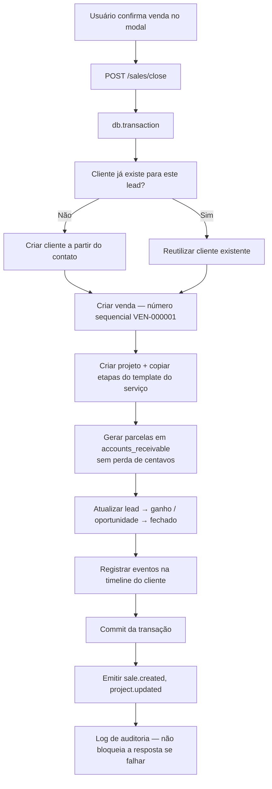

# Arquitetura — NexoDesk AI

## Visão geral

## Fluxo principal: mensagem do WhatsApp → lead

Este é o fluxo central do produto (spec §1), implementado em `apps/api/src/modules/whatsapp/message-handler.ts`.

## Fluxo: fechamento de venda (venda ganha)

Implementado em `apps/api/src/modules/sales/sales.service.ts` como uma única transação de banco (spec §22, §93) — se qualquer etapa falhar, nada é criado.

## Realtime

Eventos nomeados especificamente (`packages/shared/src/events.ts`) — nunca eventos genéricos `update`/`data` (spec §8). Cada módulo do backend emite via `shared/realtime.ts`; o frontend assina via o hook `useSocketEvent` e invalida as queries do TanStack Query correspondentes.

## WhatsApp provider — inicialização preguiçosa + Node 22 local

`whatsapp.service.ts` constrói o `WhatsAppWebProvider` sob demanda (na primeira chamada a `connect`/`disconnect`/`status`), em vez de como efeito colateral do import do módulo — evita uma colisão de inicialização entre addons nativos (Argon2, better-sqlite3) que ocorria no carregamento do módulo. A causa raiz mais profunda, porém, é do Node 24 no Windows em si: até addons nativos isolados (better-sqlite3 sozinho) e principalmente o lançamento real do Chrome pelo Puppeteer (`Client.initialize()`) disparam uma assertion nativa (`RemoveEnvironmentCleanupHook`) nessa combinação de SO+versão do Node.

A correção definitiva é de infraestrutura, não de código de aplicação: `apps/api/scripts/run-server.mjs` re-executa o servidor com um Node 22 LTS baixado localmente em `.tools/` (via `pnpm setup:node22`) sempre que ele estiver presente, sem exigir alterar a instalação global do Node. Validado com o fluxo completo — login, CRUD, e `Client.initialize()` do Puppeteer lançando o Chrome de verdade e retornando o QR Code — rodando de forma estável.

## IA local

`apps/api/src/modules/ai/ai-provider.ts` define a interface `AIProvider`; `OllamaProvider` é a única implementação hoje. Todo call-site passa por `safeAI()`, que nunca deixa uma falha de IA quebrar o fluxo principal (spec §35). Saídas do modelo são sempre validadas com Zod (spec §37) antes de tocar o banco.

## Banco de dados

Schema completo em `packages/database/src/schema/*.ts`, ~39 tabelas. Dinheiro sempre em centavos (inteiro). Datas em UTC (`timestamp_ms`), apresentadas no timezone configurado (`America/Sao_Paulo` por padrão). Ids são ULID; documentos comerciais têm numeração sequencial própria via contador durável em `settings` (`seq:PROP`, `seq:VEN`).

## Automações

`apps/api/src/modules/automations/automations.service.ts` — `runAutomation()` envolve toda automação com log de execução (sucesso/erro/pulado) em `automation_runs`, nunca invisível (spec §45). O scheduler (`scheduler.ts`) roda a cada 15 minutos verificando pagamentos a vencer, pagamentos vencidos e leads inativos.
